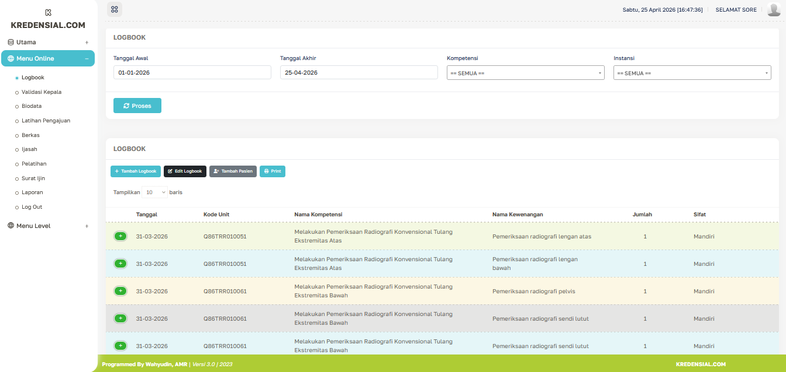

# Portofolio - Sistem Informasi SKPD 📝

Aplikasi ini adalah Sistem Informasi berbasis web yang dikembangkan menggunakan *framework* **CodeIgniter 3**. Sistem ini bertujuan untuk memudahkan pencatatan dan pengelolaan data... (tulis sedikit penjelasan di sini).

## ✨ Fitur Utama
* Halaman *Login* & Autentikasi
* Pengelolaan Data Master
* Cetak Laporan (PDF/Excel)

